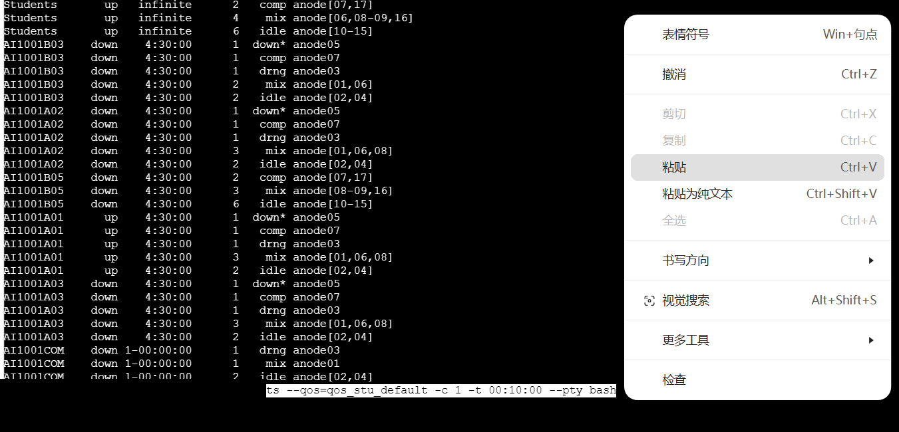

# 常见问题

本页整理使用平台时最常见的问题。具体平台策略、配额和入口可能变化，遇到与页面不一致的地方，以平台页面、课程通知或管理员说明为准。

## `nvidia-smi` 找不到或看不到 GPU

状态：待平台核验，但判断逻辑通用。

可能原因：

- 你在登录节点运行命令，登录节点通常不提供 GPU。
- 作业没有申请 GPU。
- 作业还在排队，没有真正进入计算节点。
- 环境或驱动信息需要在计算节点内查看。

建议：

1. 先确认作业脚本中申请了 GPU。
2. 在作业脚本里加入 `nvidia-smi`，从日志中查看输出。
3. 用 `squeue -u "$USER"` 确认作业状态。

## 作业一直排队

可能原因：

- 平台当前资源紧张。
- 申请的 CPU、GPU、内存或时间过多。
- partition 或 QOS 与当前账号权限不匹配。
- 触发了用户资源上限。

建议先用更小资源跑 smoke test。如果仍然排队，保存作业 ID 和 `scontrol show job <job_id>` 输出后再求助。

## 提交作业时报 `QOSMaxWallDurationPerJobLimit`

这个错误通常表示作业申请的运行时间超过当前 QOS 允许的最长时间。默认 QOS 下单个作业通常有运行时间上限；当前常见默认上限为 4 小时。

建议：

1. 检查脚本中的 `#SBATCH -t` 或 GUI 中“最长运行时间”。
2. 如果使用默认 QOS，先把运行时间调到 4 小时以内。
3. 长任务先跑短时间 smoke test，确认流程正确后再申请额外算力或更长时限。

## 提交作业时报 `QOSMaxCpuPerUserLimit`

这个错误通常表示申请的 CPU 数超过当前用户或 QOS 的限制。统一认证登录的默认配额通常包含 4 CPU。

建议：

1. 检查 `--cpus-per-task`、GUI 中 CPU 核心数字段，以及额外 sbatch 参数。
2. 第一次提交先使用不超过 4 核的配置。
3. 如果确实需要更多 CPU，先准备任务说明和日志，再通过平台申请额外算力。

## 没有日志文件

常见原因：

- `logs/` 目录不存在。
- `#SBATCH -o` 或 `#SBATCH -e` 路径写错。
- 作业还没开始运行。
- 脚本在写日志前就被 Slurm 拒绝或取消。

提交前可以运行：

```bash
mkdir -p logs
```

并检查脚本中日志路径是否相对于项目目录或使用了明确的绝对路径。

## 训练 OOM

OOM 可能指内存不足，也可能指 GPU 显存不足。先看错误信息：

- `CUDA out of memory`：优先减小 batch size、模型规模或输入尺寸。
- 系统直接杀进程：可能是内存不足，减少数据加载并发，或申请更多内存。
- 数据加载很慢但没有 OOM：可能是文件组织、worker 数或存储 I/O 问题。

不要只靠盲目增加资源解决。先用小数据确认流程正确，再逐步扩大。

## conda 安装 PyTorch 后还是 CPU 版

登录节点通常没有 GPU。如果在没有 GPU 的登录节点上安装，conda 可能默认解析出 CPU 版 PyTorch。可以在清理原环境后，通过环境变量强制指定 CUDA 版本。

示例：

```bash
CONDA_OVERRIDE_CUDA="12.4" conda install pytorch torchvision torchaudio pytorch-cuda=12.4 -c pytorch -c nvidia -y
```

CUDA 版本应按当前平台驱动和课程要求选择，不要机械照抄 `12.4`。安装后请在已申请 GPU 的作业中检查 `torch.cuda.is_available()`。

## 作业里找不到 conda

不需要每次提交作业都重新安装环境。更常见的问题是：交互式终端里能 `conda activate`，但批处理作业没有加载 conda 初始化脚本。

在作业脚本中显式写入：

```bash
set +u
source ~/miniconda3/etc/profile.d/conda.sh
conda activate py310
set -u
```

如果你的 conda 安装在其他路径，请把 `~/miniconda3` 改成实际路径。

## CPU workers 越多越快吗

不一定。数据加载 worker 太少会喂不饱 GPU，太多也可能造成 CPU 争用、内存压力和文件系统压力。建议做小规模 benchmark，记录每组配置的单步时间、GPU 利用率和是否稳定。

## 退出浏览器后任务会不会停

批处理作业提交给 Slurm 后，通常不依赖浏览器页面继续打开。交互式 Shell、网页终端或 GUI 任务的行为可能不同，需要以平台当前说明为准。

Web 终端断线后，正在终端里跑的交互式作业可能受影响。需要维持交互式会话时可以尝试 `tmux`，长任务更推荐写成批处理作业。

## VS Code 不能复制粘贴或访问剪切板

如果当前访问方式不是 HTTPS，浏览器可能会限制 VS Code 访问剪切板和一些相关功能。可以优先尝试：

- 使用浏览器地址栏或平台提供的 HTTPS 访问方式。
- 改用终端命令创建文件，例如 `nano` 或网页文件编辑器。
- 查询课程群或助教给出的当前处理方式。

## 登录账号或密码不确定

账号和登录方式以平台页面、课程通知或助教说明为准。如果仍无法登录，不要反复尝试大量密码，应按课程或平台通知联系助教。

## VS Code 中运行 Python 文件失败

先确认三件事：

- 当前 VS Code 打开的 workspace 是代码所在文件夹。
- 终端中已经 `conda activate <env>`。
- 运行命令时位于代码文件所在目录，必要时先 `cd /path/to/project`。

如果使用右上角运行按钮，还要确认 VS Code 选择的是正确 Python 解释器。

## Web 终端快捷键不好用

部分组合键可能被浏览器、操作系统或扩展拦截。例如 Mac 上的某些 `Ctrl + 方向键` 组合可能不会传到 Web 终端。

在终端里，`Ctrl+C` 通常表示中断当前程序，不是复制；`Ctrl+V` 也可能被浏览器或终端组件拦截。因此 Web Shell 不一定接受键盘快捷键粘贴。

实际测试可用的方式：

- 复制：用鼠标选中终端里的文本，然后右键选择复制。
- 粘贴：在终端输入区域右键，选择粘贴。
- 如果浏览器弹出剪贴板权限提示，按当前浏览器提示授权或改用右键菜单。



建议：

- 先换一个浏览器或关闭可能拦截快捷键的扩展。
- 如果是 tmux 快捷键冲突，可以改 tmux keybinding。
- 对必须长时间运行的任务，尽量用批处理作业，减少对 Web 终端交互的依赖。

## 不能 SSH 登录

如果平台页面或课程通知没有提供 SSH 入口，不要假设可以直接用本地 `ssh` 登录。因此文档中的主线流程以 Web GUI、文件管理、登录集群 Shell 和 Slurm 作业为准。

如果需要传文件，优先使用平台文件管理；如果 GitHub 或外网下载不稳定，可以在本地下载后上传。

## 连不上 GitHub 或外网下载失败

可能原因包括平台网络策略、外部站点连接不稳定或仓库镜像不完整。建议：

- 优先使用中科大镜像源、PyPI/conda 镜像或课程提供的下载地址。
- 代码仓库可以先在本地克隆，再打包上传。
- 大模型、数据集等外部资源不要假设平台能直接下载，先准备可复现的本地上传方案。

## 上传压缩包后大小不对

如果上传后的压缩包大小明显小于本地文件，不要直接解压使用，应先检查文件完整性。

建议：

1. 上传前记录本地文件大小。
2. 上传后在文件管理或 Shell 中确认远端文件大小。
3. 对重要文件生成校验值，例如本地和平台分别运行 `sha256sum 文件名`。
4. 如果大文件反复失败，尝试分卷压缩或改用平台推荐传输方式。

## `nvidia-smi` 报 Driver/library version mismatch

如果在已申请 GPU 的计算环境中运行 `nvidia-smi`，出现 `Failed to initialize NVML: Driver/library version mismatch`，通常说明运行环境中的 NVML/驱动库版本与节点驱动不匹配。

建议：

- 先记录作业 ID、节点名、申请的 GPU 类型、完整 `nvidia-smi` 报错。
- 检查是否在环境中安装了会覆盖系统驱动库的 NVIDIA 相关包。
- 不要在同一环境中反复混装不同 CUDA/NVIDIA 包；必要时新建干净环境复现。
- 将信息反馈给平台维护者，因为这类问题可能需要平台侧处理。

## 求助时应提供什么

- 问题发生的步骤。
- 作业 ID。
- 提交脚本。
- `.out` 和 `.err` 日志关键内容。
- 资源申请参数。
- 你已经尝试过的排查动作。
